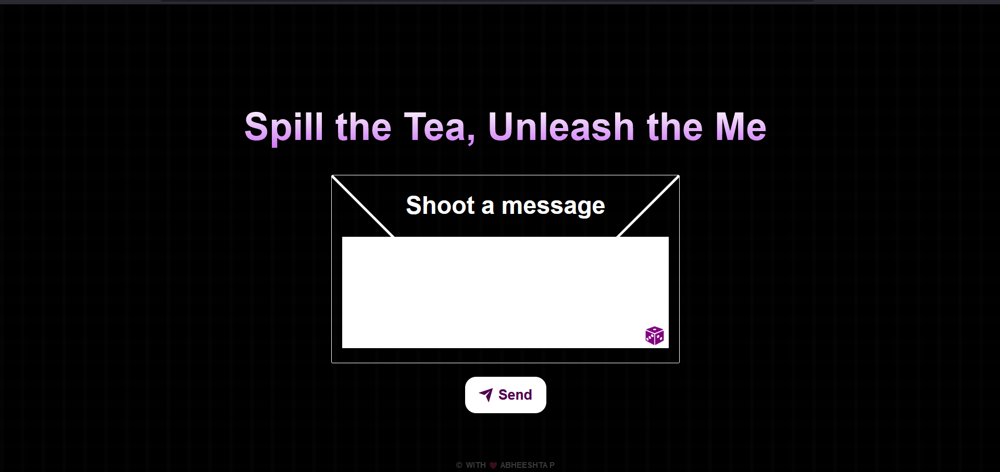
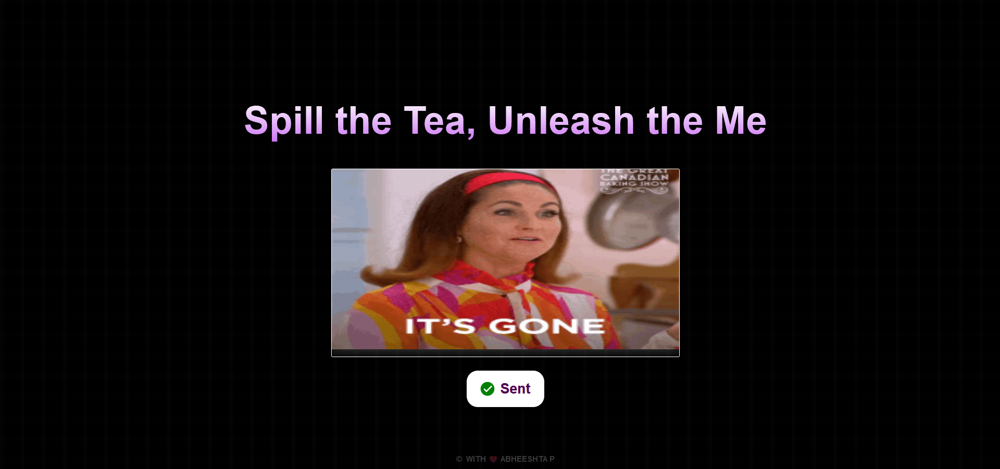

<h1 align="center"> 📨 Anon Spil </h1>

Welcome to the **AnonSpil** project! This web application allows users to send anonymous messages via a webhook. It's a fun and interactive way to share thoughts or ask questions anonymously.

## 🌟 Features

- **Send Anonymous Messages:** Users can type their message in a text area and send it anonymously.
- **Random Question Generator:** If users can't think of something to say, they can click the randomize button to generate a random question.
- **Animated GIF Feedback:** Displays animated GIFs to indicate message sending status (success, error, or no message).
- **Responsive Design:** Works well on different screen sizes, ensuring a great user experience on both desktop and mobile devices.

## 👩🏻‍💻 Tech Stack

- **HTML:** The backbone structure of the application.
- **CSS:** Styled using modern CSS techniques, including flexbox and media queries for responsiveness.
- **JavaScript:** Handles the interactive functionality, including sending messages via Discord webhook, generating random questions, and displaying feedback GIFs.

## 📸 Screenshots

## 🎨 Customization

- **Update Webhook URL:** Modify the `webhookUrl` variable in the JavaScript section of the HTML file with your webhook URL.
- **Add Custom GIFs:** Place your custom GIFs in the respective directories and update the JavaScript paths accordingly.
- **Change Random Questions:** Modify the `questionArray` in the JavaScript section to include your preferred questions.

## 🛠️ Usage

1. **Open the application in a web browser.**
2. **Type your anonymous message in the text area.**
3. **Click the "Send" button to submit your message.**
4. **Optional:** Click the randomize button to generate a random question if you're unsure what to write.

## 🚀 Live 
[Anonymous messenger](https://anonspil.netlify.app/)

## 🤝 Contributing
This is not meant for contributing as this is personal project

### ⚙️All rights are reserved

